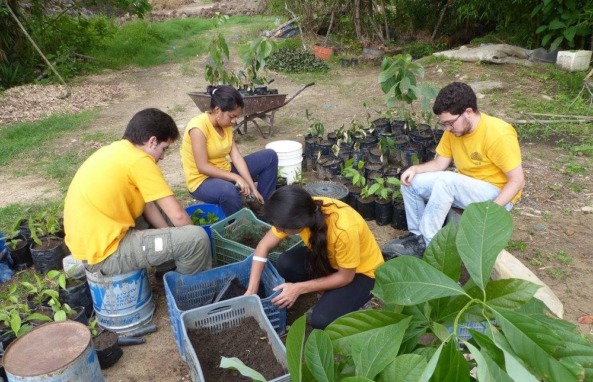
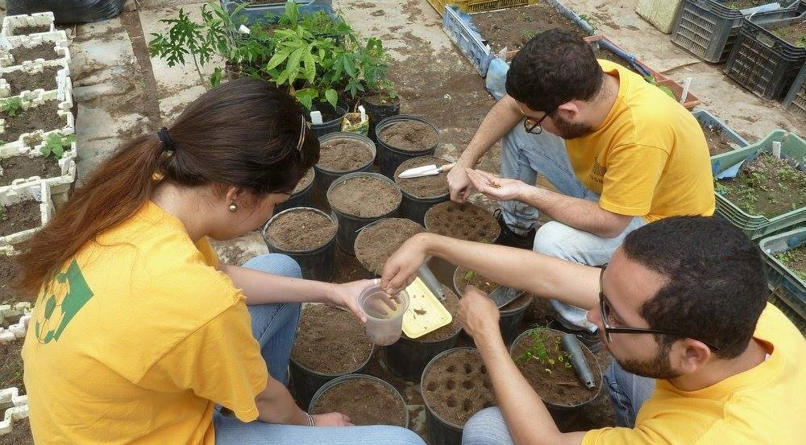
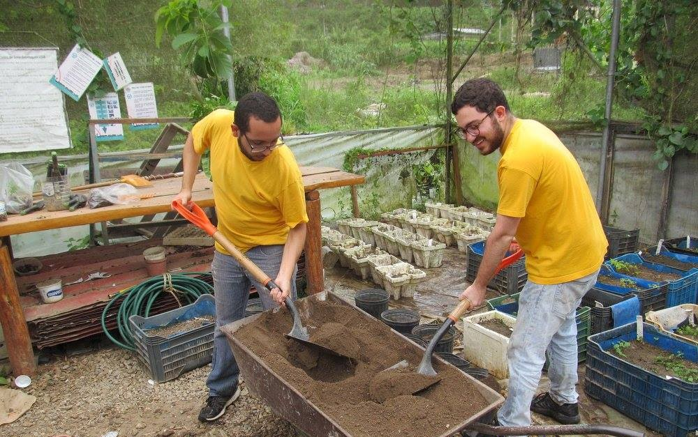
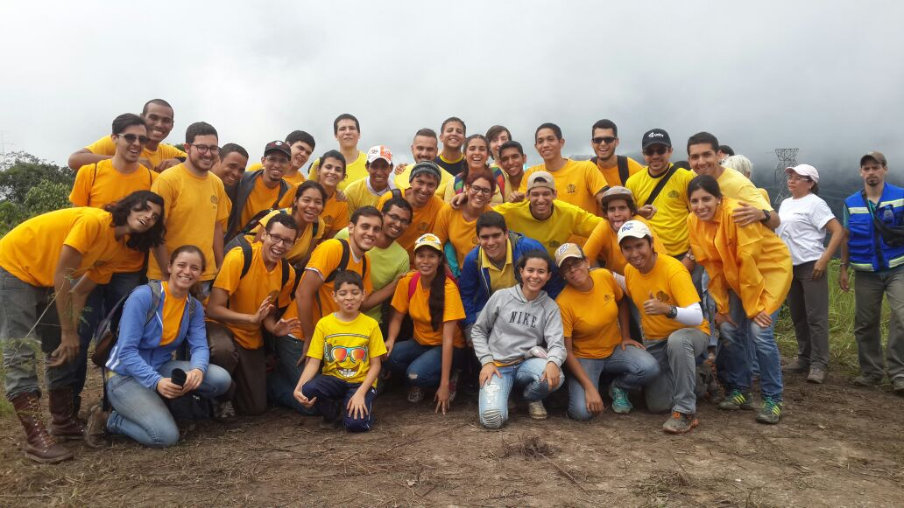

\newpage

# Anexos

## Bitácora de Actividades

|        Semana        | Actividades                                           | Horas trabajadas |
|:--------------------:|:------------------------------------------------------|-----------------:|
| Semana I             | Desmalezamiento en el vivero 2                        | 4                |
| (9 al 11 de dic 2016)| Inducción a a las Eco-Rutas                           | 4                |
|                      |                                                       |                  |
| Semana II            | Regado de viveros 1 y 2                               | 3.5              |
| (12 al 18 de dic)    | Mantenimiento de vivero 1 y siembra de leucaenas      | 4                |
|                      |                                                       |                  |
| Semana III           | Desmalezado de parcela de planta química              | 4                |
| (19 al 22 de dic)    | Riego y transplante en vivero de SADARBOL             | 4                |
|                      |                                                       |                  |
| Semana IV            | Riego y mantenimiento de vivero 2                     | 3.5              |
| (2 al 8 de ene 2017) | Desmalezamiento de vivero 2                           | 4                |
|                      |                                                       |                  |
| Semana V             | Mantenimiento y desmalezado de vivero 1               | 3.5              |
| (9 al 15 ene)        | Riego y mantenimiento de vivero 1                     | 4                |
|                      |                                                       |                  |
| Semana VI            | Desmalezado y transplante en parcela planta química   | 4                |
| (16 al 22 ene)       | Mantenimiento vivero 1                                | 3.5              |
|                      |                                                       |                  |
| Semana VII           | Eco-Ruta vivero: fábrica de vida                      | 4                |
| (23 al 29 ene)       | Eco-Ruta vivero: fábrica de vida                      | 4                |
|                      |                                                       |                  |
| Semana VIII          | Eco-Ruta vivero: fábrica de vida                      | 4                |
| (30 ene al 5 feb)    | Ensamble de huerto en Unidad Educativa USB            | 4                |
|                      |                                                       |                  |
| Semana IX            | Eco-Ruta vivero: fábrica de vida                      | 4                |
| (6 al 12 feb)        | Desmalezado de vivero 2                               | 3.5              |
|                      |                                                       |                  |
| Semana X             | Eco-Ruta vivero: fábrica de vida                      | 3.5              |
| (13 al 19 feb)       | Mantenimiento de vivero 1                             | 4  nueva pag     |
|                      |                                                       |                  |
| Semana XI            | Mantenimiento vivero 2                                | 3.5              |
| (20 al 26 feb)       | Mantenimiento vivero 1                                | 4                |
|                      |                                                       |                  |
| Semana XII           | Eco-Ruta vivero: fábrica de vida                      | 4                |
| (27 feb al 5 mar)    | Recubrimiento de talud de vivero 2                    | 3.5              |
|                      |                                                       |                  |
| Semana XIII          | Eco-Ruta vivero: desarrollo sustentable               | 4                |
| (6 al 12 mar)        | Transplante de árboles y sembrado de palmas           | 4                |
|                      |                                                       |                  |
| Semana XIV           | Recolección de semillas de majagua                    | 4                |
| (13 al 19 mar)       | Desmalezado de vivero 2                               | 4                |
|                      |                                                       |                  |
| Semana XV            | Mantenimiento de vivero 2                             | 4                |
| (20 al 26 mar)       | Eco-Ruta:fábrica de vida (Colegio Hipocampitos)       | 3.5              |
|                      |                                                       |                  |
| Semana XVI           | Transplante y riego en vivero 2                       | 4                |
| (27 mar al 2 abr)    | Eco-Ruta vivero: fábrica de vida (4to grado)          | 4                |
|                      |                                                       |                  |
| Semana XVII          | Mantenimiento de vivero 2                             | 4                |
| (3 al 9 abr)         | Regado vivero 1 y mantenimiento vivero 2              | 4                |
|                      |                                                       |                  |
|                      |                                                       |                  |
| ***Total***          |                                                       |  131.5           |

\newpage

## Fotos

